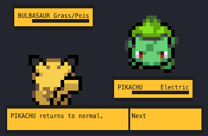

_This project has been created as part of the 42 curriculum by seoliver._

# Module 07 🐾 Abstract Card Architecture


**Master Python’s design patterns with abstract classes and interfaces.**

Here you will learn how to model systems with abstract classes, inheritance, and strategy-driven behavior. This module focuses on factory patterns, interfaces, and combat logic built around flexible creature and battle designs.

## Module contents

| Exercises | Contents |
| ---------- |--------- |
| [ex0](battle.py), [ex1](capacitor.py), [ex2](tournament.py) | class factories, interfaces, strategy patterns

## Learn:
* [Python Polymorphism](https://www.w3schools.com/python/python_polymorphism.asp), by W3 schools
* [Abstract Classes in Python](https://www.geeksforgeeks.org/python/abstract-classes-in-python/), by GeeksforGeeks

## Notes
- Have you catch them all?

## Code example
```python
class Bulbasaur(Creature, HealCapability):
    def __init__(self) -> None:
        super().__init__("Bulbasaur", "Grass/Poison", "001")

    def attack(self) -> str:
        return f"{self.name} uses Vine Whip!"
```